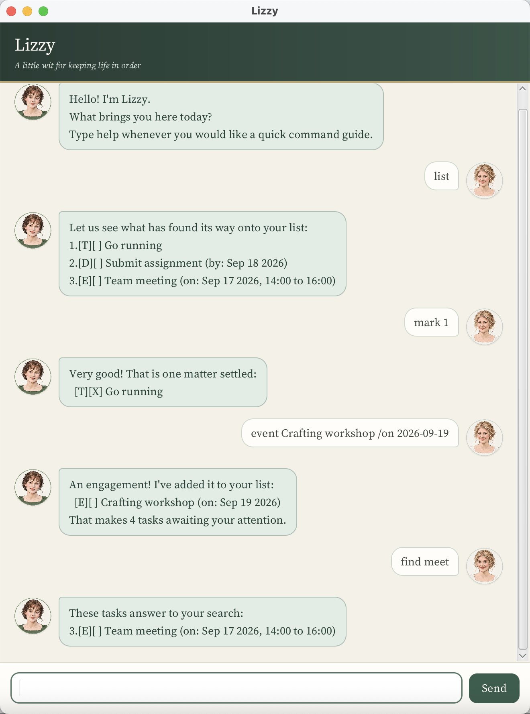

# Lizzy User Guide

> A little wit for keeping life in order.

Lizzy is a desktop task manager with a warm, lightly witty personality. She
keeps todos, deadlines, events, and flexible completion periods in one
searchable list, and remembers them between sessions.

<p align="center">
  
</p>

## Quick start

1. Install **Java 25**.
2. Download `lizzy.jar` from the
   [latest release](https://github.com/Yanrong-Wang/ip/releases/latest).
3. Put the JAR in its own folder and open a terminal in that folder.
4. Run:

   ```sh
   java -jar "lizzy.jar"
   ```

Type a command in the box at the bottom, then press **Enter** or click
**Send**. Command words are lowercase. Dates use `yyyy-MM-dd`, for example
`2026-09-10`. Times, where supported, use 24-hour `HH:mm`, for example
`14:00`.

> **Command notation:** words in angle brackets such as `<description>` are
> values you supply. Do not type the angle brackets.

## Command summary

| Purpose | Command |
|---|---|
| Add a todo | `todo <description>` |
| Add a deadline | `deadline <description> /by <date>` |
| Add a one-day event | `event <description> /on <date>` |
| Add a timed event | `event <description> /on <date> /from <HH:mm> /to <HH:mm>` |
| Add a multi-day event | `event <description> /from <date> /to <date>` |
| Add a task for a flexible period | `within <description> /from <date> /to <date>` |
| Show every task | `list` |
| Find tasks | `find <keyword>` |
| Show scheduled tasks on a date | `on <date>` |
| Mark a task complete | `mark <task number>` |
| Mark a task incomplete | `unmark <task number>` |
| Delete a task | `delete <task number>` |
| Show command help | `help` |
| Exit Lizzy | `bye` |

## Features

### Adding a todo

Use a todo for a task without a date.

```text
todo Read chapter 6
```

### Adding a deadline

Use a deadline for work that must be completed by one date.

```text
deadline Submit CS2103 iP /by 2026-09-18
```

### Adding an event

Use an event for an engagement fixed to a particular day or inclusive date
range, such as a team meeting.

```text
event Team meeting /on 2026-09-17
event Team meeting /on 2026-09-17 /from 14:00 /to 16:00
event Orientation /from 2026-09-17 /to 2026-09-19
```

Times use 24-hour `HH:mm` format. A timed event must end later than it starts.
If a date range begins and ends on the same date, Lizzy treats it as a
one-day event and displays it using `on`. Prefer `/on` when entering such an
event because it expresses the intention more clearly.
Lizzy presents parsed dates in a friendlier form such as `Sep 17 2026`, while
times remain in the same 24-hour form used in commands, such as `14:00`.

### Adding a task to complete within a period

Use `within` when a task is not fixed to one day and may be completed at any
time in an inclusive period. It represents a flexible completion window, not
an activity that necessarily lasts continuously from the first date to the
last.

```text
within Polish user guide /from 2026-09-16 /to 2026-09-18
```

Lizzy displays these tasks with a `[W]` marker. As with events, the end date
cannot be before the start date.

### Listing tasks

```text
list
```

Lizzy numbers the tasks in their current order. Use these numbers with
`mark`, `unmark`, and `delete`; the numbers may change after a deletion.

### Marking and unmarking tasks

```text
mark 2
unmark 2
```

A completed task has an `[X]` status marker. An incomplete task has `[ ]`.

### Deleting a task

```text
delete 3
```

This permanently removes the selected task from the list.

### Duplicate tasks

Lizzy rejects a task when its type and all its details match a task already
in the list. Completion status is ignored, so marking a task does not make it
possible to add the same task again. Tasks with the same description but a
different type, date, or time remain distinct and are accepted. Description
comparison uses the exact text, including letter case.

### Finding tasks

```text
find meet
```

Lizzy searches for the keyword anywhere inside task descriptions, without
regard to letter case. For example, `find meet` matches `Team meeting`.
Matching results keep their original task numbers.

### Viewing command help

```text
help
```

Lizzy gives a compact reminder of every command's format and purpose,
including the required date and time formats.

### Viewing one day's schedule

```text
on 2026-09-17
```

Lizzy shows deadlines on that date and events or flexible-period tasks whose
inclusive date ranges contain it. Undated todos are not shown.

### Exiting

```text
bye
```

Lizzy says goodbye and closes the application.
In the graphical interface, the command field is disabled and the window
closes automatically after a brief pause, so no further manual close is
needed.

## If something goes wrong

Lizzy explains invalid commands in the conversation and shows the expected
format. Extra spaces around words are accepted, but required markers such as
`/by`, `/from`, and `/to` must appear exactly once and in the order shown.
Formatting mistakes such as `17/09/2026` receive syntax guidance, while
well-formed but impossible values such as `2026-02-30` or `25:00` receive a
separate calendar or clock error.

If the data file is missing, Lizzy starts with an empty task list and creates
the file when the first task is saved. If the file cannot be read or contains
invalid data, Lizzy reports the problem and starts a safe, empty session
instead of crashing. A save failure is also reported without ending the
session.

## Saving data

Lizzy saves tasks automatically in `data/lizzy.txt`, relative to the folder
from which the JAR is run. Keep `lizzy.jar` in a dedicated folder if you want
its task data to stay together with the application.

## Acknowledgements

See the
[project acknowledgements](https://github.com/Yanrong-Wang/ip#acknowledgements)
for AI-assistance, reused-work, asset-attribution, and licence details.
